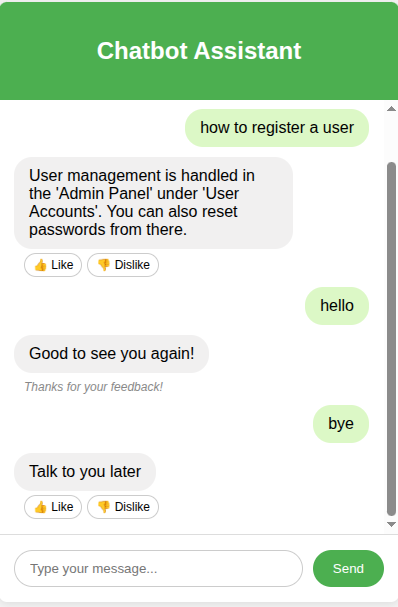
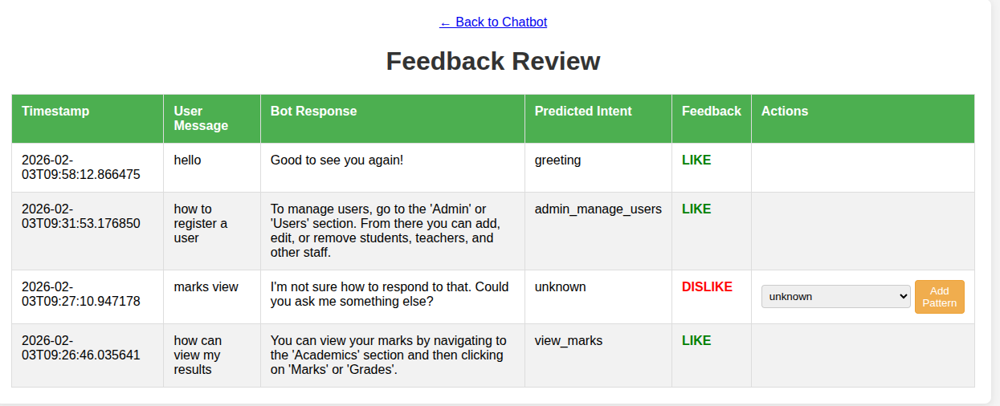

# Intelligent School Management Chatbot

A web-based chatbot designed to assist users of a school management system. Built with PyTorch and Flask, it features a continuous learning loop powered by user feedback, allowing it to become more accurate over time.

## Features

-   **Natural Language Understanding**: Powered by a PyTorch-based neural network to understand user intents from conversational language.
-   **Web-Based Interface**: A clean and simple chat interface built with Flask, allowing users to interact with the bot in a friendly way.
-   **Human-in-the-Loop Learning**: Users can provide instant feedback on the bot's responses by clicking "like" (👍) or "dislike" (👎) buttons.
-   **Admin Feedback Dashboard**: A dedicated page (`/review`) for administrators to view all user feedback in a structured table.
-   **One-Click Retraining**: Administrators can correct the bot's mistakes directly from the dashboard. Disliked responses can be reassigned to the correct intent, which automatically updates the training data file.
-   **Optimized Training**: Implements a learning rate scheduler for more stable and effective model training.

## Screenshots

**Main Chat Interface**
*A clean, intuitive interface for users to interact with the chatbot.*


**Feedback Review Dashboard**
*Administrators can easily review feedback, spot incorrect responses (highlighted in red), and add the user's message to the correct intent with a single click.*


## Technology Stack

-   **Backend**: Python, Flask
-   **Machine Learning**: PyTorch
-   **NLP**: NLTK (Natural Language Toolkit)
-   **Frontend**: HTML, CSS, JavaScript

## Project Structure

```
chatbot/
├── code/
│   ├── main.py             # Main script for training the chatbot model.
│   ├── app.py              # Flask web application to serve the chatbot.
│   ├── intents.json        # The core training data: intents, patterns, and responses.
│   ├── feedback.jsonl      # Log file for all user feedback (created automatically).
│   ├── chatbot_model.pth   # The saved, trained model weights (created after training).
│   ├── dimensions.json     # Saved model dimensions (input/output size).
│   └── templates/
│       ├── index.html      # The main chatbot user interface.
│       └── review.html     # The admin feedback review dashboard.
├── screenshots/            # Contains screenshots for the README.
└── README.md               # This file.
```

## Setup and Installation

### 1. Prerequisites

-   Python 3.7+
-   `pip` for package management

### 2. Clone the Repository

If you are using Git, clone the repository to your local machine.

```bash
git clone <your-repository-url>
cd chatbot
```

### 3. Create a Virtual Environment

It's highly recommended to use a virtual environment to manage project dependencies.

**On macOS/Linux:**
```bash
python3 -m venv venv
source venv/bin/activate
```

**On Windows:**
```bash
python -m venv venv
.\venv\Scripts\activate
```

### 4. Install Dependencies

Create a `requirements.txt` file in the `code` directory with the following content:

```txt
flask
torch
nltk
numpy
```

Then, from the `chatbot` root directory, install the packages:

```bash
pip install -r code/requirements.txt
```

### 5. Download NLTK Data

Run the following commands in a Python interpreter to download the necessary NLTK packages for tokenization and lemmatization:

```python
import nltk
nltk.download('punkt')
nltk.download('wordnet')
```

## How to Run the Chatbot

All commands should be run from within the `code/` directory.

```bash
cd code
```

### 1. Train the Model
The first step is to train the neural network. This script reads `intents.json`, trains the model, and saves the output as `chatbot_model.pth` and `dimensions.json`.

```bash
python main.py
```

### 2. Run the Web Application
Once the model is trained, start the Flask web server.

```bash
python app.py
```

### 3. Access the Application
Open your web browser and navigate to:
-   **Chat Interface**: `http://127.0.0.1:5000`
-   **Feedback Review Page**: `http://127.0.0.1:5000/review`

## The Feedback Loop: How to Improve the Model

The key feature of this project is its ability to learn from mistakes.

1.  **Collect Feedback**: As users interact with the bot, they can click the **👍 Like** or **👎 Dislike** buttons. This feedback is automatically saved to `feedback.jsonl`.
2.  **Review Feedback**: An administrator visits the `/review` page to see all the feedback. "Disliked" responses are highlighted in red, making them easy to spot.
3.  **Correct Mistakes**: For each disliked response, the admin selects the correct intent from the dropdown menu and clicks **"Add Pattern"**. This automatically adds the user's original message to the `patterns` list of the correct intent in `intents.json`.
4.  **Retrain the Model**: After adding new patterns, stop the Flask server (`Ctrl+C` in the terminal) and run the training script again:
    ```bash
    python main.py
    ```
5.  **Restart the Server**: Restart the web application (`python app.py`). The chatbot is now smarter and will recognize the new patterns!